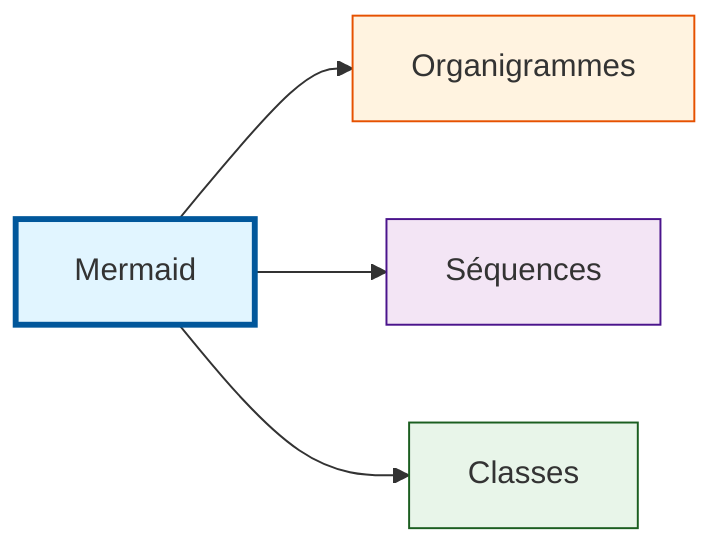
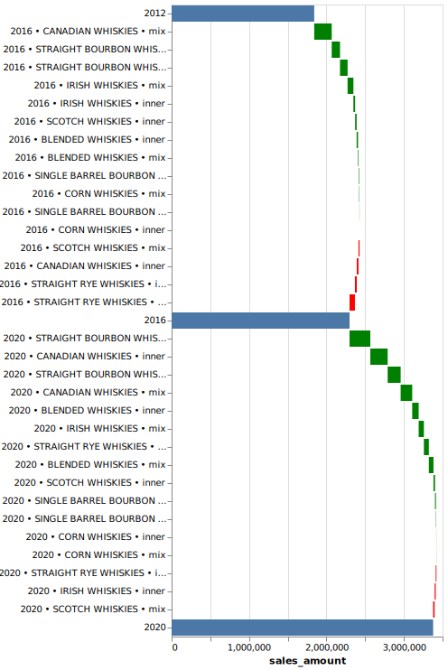
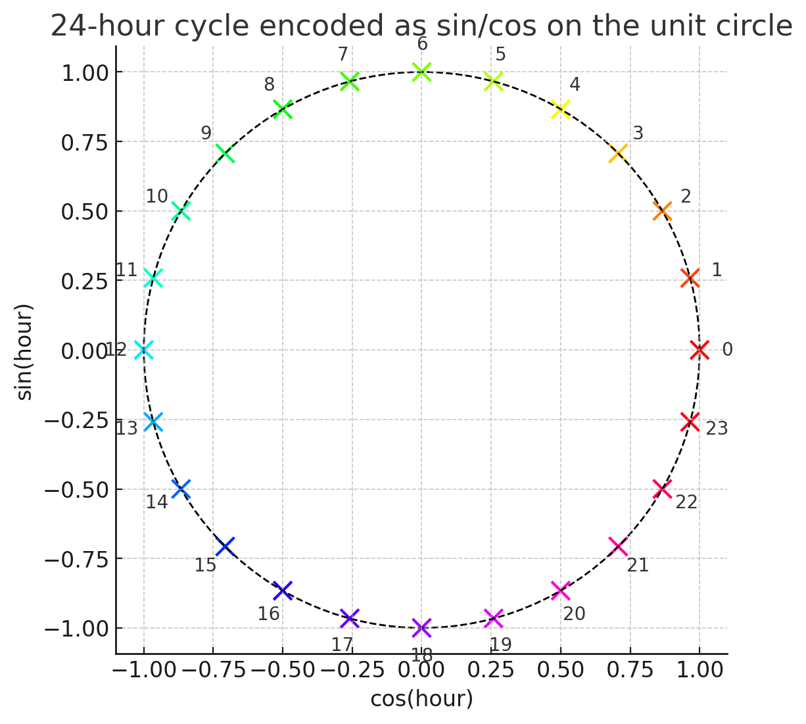
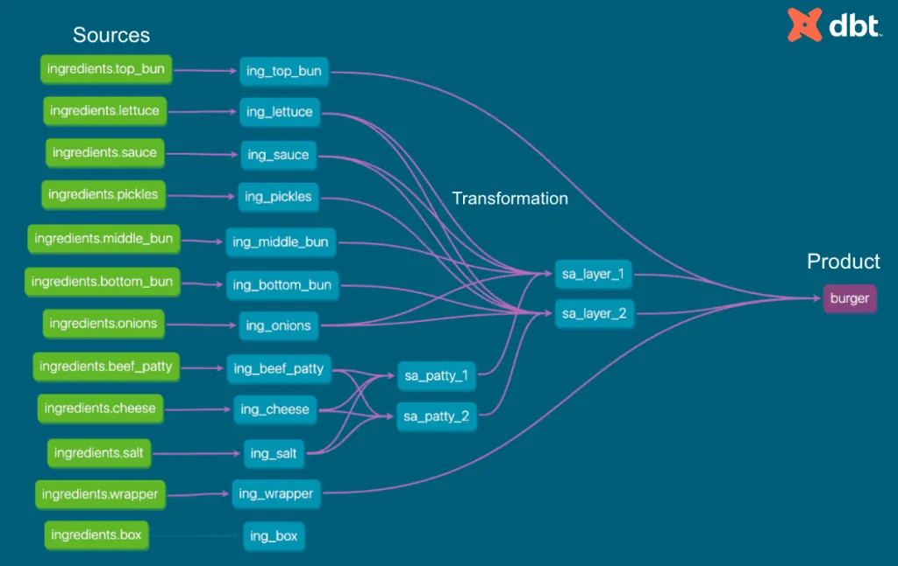
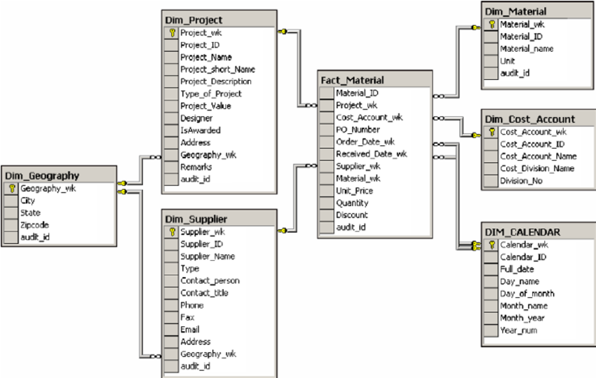

## Partage de connaissances - Master MIASHS 

[TOC]

#### Gérer les dépendances d'un projet Python

Python et les librairies Python évoluent rapidement:


Un code écrit pour `pandas 1.0`  ne fonctionera probablement pas avec `pandas 2.0`.


On a besoin d'expliciter les dépendances utilisées par un projet afin de garantir la reproductibilité de l'environnement d'exécution.

`uv` est devenu le principal outil pour gérer les environnements (remplace progressivement `conda`).

``````bash
# Créer un environnement virtuel
uv init

# Ajouter des dépendances
uv add pandas

# Activer l'environnement dans VS Code ou dans le terminal
.venv\Scripts\activate 			# Windows (PowerShell)
source .venv/bin/activate 	# MacOS

# Synchronise l'environnement virtuel avec le `uv.lock`
uv sync

# uvx permet d'exécuter "à la volée" des commandes dépendant de libraries Python
uvx marimo edit
``````

#### Utiliser le terminal

```````bash
# Se déplacer dans un dossier
cd ./dossier
# Et revenir au dossier parent
cd ..

# Flèche ⬆️ / ⬇️ pour se déplacer dans l'historique
# CTRL + C pour interrompre une commande en cours d'exécution

# Ouvrir le dossier dans VS Code (-r pour ouvrir dans la fenêtre actuel VS Code)
code . -r

# MacOS - définir des alias
alias c='code . -r'
alias cdmaster='cd "/Users/mathisderenne/Documents/02 - Scolaire/M2 MIASHS/"'
alias cdgh='cd /Users/mathisderenne/GitHub/'

# Windows (PowerShell) - définir des alias
function c { code . -r }
function cdgh { cd "C:/Users/mathisderenne/GitHub" }
```````

**Améliorer son expérience dans le terminal en installant un shell: https://starship.rs/**

#### Partager et collaborer sur du code

`Git`: permet de versionner un dossier:

- [tutoriel interactif](https://learngitbranching.js.org/?locale=fr_FR) pour apprendre à maîtriser Git
- interface de l'extension VS Code Git

`Git` != `GitHub`/`GitLab` : plateforme d’hébergement de projets Git


**Quelques conventions sur la structure des projets Git**:

- `README.md` décrit le projet 
- `.gitignore`précise les éléments ignorés par Git
- dossiers courant:
  - `./src`: code source du projet
  -  `./assets`: images, logos
  -  `./docs`, `./data`, `./test`


`GitHub Pages`permet d’héberger une page statique gratuitement -> utile pour CV en ligne ([tutoriel en 5 minutes](https://gemini.google.com/app/efb550fc7df0d29e)) / projets démos.

#### VS Code

- éditer les notebooks (Python et R)
- formatter le code automatiquement ([extension Ruff](https://marketplace.visualstudio.com/items?itemName=charliermarsh.ruff))
- lire des fichiers PDF ([extension PDF Viewer](https://marketplace.visualstudio.com/items?itemName=mathematic.vscode-pdf))
- explorer des fichiers de données tabulaires ([extension Data Wrangler](https://marketplace.visualstudio.com/items?itemName=ms-toolsai.datawrangler))
- GitHub Copilot ([gratuit pour les étudiants](https://docs.github.com/fr/education/about-github-education/github-education-for-students/apply-to-github-education-as-a-student))
- mes [settings.json](https://gist.github.com/mathisdrn/2c46f1924edbfb905e4023d0251d0a8b)

#### [Positron](https://positron.posit.co/): nouveau IDE pour R

#### Rédaction scientifique et communication autour de projets data

- rédiger rapport de stage/alternance: **Typst** ([extension Tinymist](https://marketplace.visualstudio.com/items?itemName=myriad-dreamin.tinymist))  
- présenter des projets data avec **MystMD**
- créer des diagrammes avec **Mermaid** ([Mermaid Live Editor](https://mermaid.live/edit#pako:eNpFjctqwzAQRX9FzNo1fslxtU3pA1ooNJsWbxRr7IjImqBItKnxv1dxaHJXM4dzZyboSCEI8HpEoy22lsV47Q2yZ3305E6MevZBnZaGvaHSkr0b6Xty48Utsqxggr1qu0f1Yq-wivBRdrgl2l_gEsGeiAaDV49H9ElhE7Y3Vke2-dbeo4MEBqcVCO8CJjCiG-V5helst-B3OGILIo4KexmMb6G1c6wdpP0iGv-bjsKwA9FLc4xbOCjp8UHLwcmbglahW1OwHgRfLoCY4AfEXV6kvC54VTRlnWX3qyqBE4gyy9O85Hld8Qh5U88J_C4_s7RZ8fkPJlNpRA))



- création de web data app avec [Streamlit](https://streamlit.com/doc/)
- notebooks **Marimo** (démo [ici](https://molab.marimo.io/notebooks/nb_jJiFFtznAy4BxkrrZA1o9b/app?show-code=true))

#### Librairie Python

- manipuler des données tabulaires: `polars` ([user guide](https://docs.pola.rs/), [comparaison avec pandas](https://kevinheavey.github.io/modern-polars/))

- création de visuels: `altair` ([exemple](https://github.com/mathisdrn/Fuel-Consumption-App))

---

#### Business Intelligence

Rendre interprétable et actionnable les données métiers.


Décomposer un indicateur à partir de ses composantes ->

- par catégorie (de produits, etc.)

- dans le temps

- calculer l'évolution en % YoY

- décomposer par quantité et panier moyen: [Answering "Why did the KPI change?" using decomposition](https://maxhalford.github.io/blog/kpi-evolution-decomposition/)

  

- fonctionne aussi avec des métriques de funnel ([voir](https://maxhalford.github.io/blog/funnel-decomposition/)): `revenue = impressions * click_rate * conversion_rate * spend`

[Package Python icanexplain](https://carbonfact.github.io/icanexplain/examples/iowa-whiskey-sales/)

#### Considération autour des modèles de prédictions

- faut-il mieux prédire `prix total` ou bien `prix moyen` et `quantité` ?

  -> prédire directement le prix total: offre généralement des meilleurs performance, modèle simple mais effet boîte noir

  -> prédire indépendamment les deux variables:

  - explicite différents facteurs d'influence du `prix total`
  - meilleure interprétabilité et actionnabilité
  - permet d'isoler les erreurs et d'analyser la performance individuelle des modèles

#### Feature engineering

> **Objectif:** améliorer la performance d'un modèle en lui fournissant les données explicatives clés

1. apporter des données externes explicatives (ex: données de localisation)
2. transformant les features pour réduire la complexité du problème

Exemples de features engineering:

- faut-il mieux fournir: (hauteur et largeur) ou (surface et ratio hauteur/largeur)

- métrique dérivée: `ancienneté = aujourd'hui - date_creation`

- encodages cycliques: [angle en degré, heure de la journée](https://www.tensorflow.org/tutorials/structured_data/time_series?hl=fr#feature_engineering)

  

- encoder des coordonnées spatiales (x, y)

  - représentation polaire (angle + distance)
  - sans apport de données externes: K-means distance
  - avec des données externes: distances aux grandes villes
  - apport de données externes: démographique (population, niveau de revenu, etc.), géographique (surface, type de terrain), etc.

- données textuelles: TF-IDF (Term Frequency-Inverse Document Frequency)

- données temporelles: analyser les saisonalités à différentes échelles (par semaine, mois, jour de l'année) avec par exemple la transformée de Fourier ou vos connaissances métiers et ajouter des colonnes explicatives pertinente (`is_holiday`, `is_weekend`)

- cas de problèmes beaucoup plus complexe: comment encoder une position du jeu d'échec ? comment encoder une image ? comment encoder des données textuelles ? comment encoder le repliement de protéines ? ([Geometric Deep Learning](https://geometricdeeplearning.com/))

  

  -> nombreux types de données ne possèdent pas une modélisation évidente / pleinement efficace

  -> souvent une combinaison: features engineering avancé; architecture spécifique; grande puissance de calcul.

  -> l'absence de modélisation pleinement efficace participe aussi à l'absence de robustesse des modèles.


#### Les pipelines sklearn

``````python
import polars as pl

# Load data
df = pl.read_csv("../data/data.csv")

# Preprocess data at row-level check ✅
df = df.with_columns(
    [
        pl.col("date").dt.weekday().alias("weekday"),
        pl.col("date").dt.hour().alias("hour"),
        pl.col("date").dt.month().alias("month"),
    ]
)

# Preprocess data row using heuristics from dataset ❌
import polars.selectors as cs

df = df.with_columns(
    (cs.numeric() - cs.numeric().mean()) / cs.numeric().std()
)

# Preprocess data using sklearn pipeline ✅
from sklearn.preprocessing import StandardScaler, OneHotEncoder
from sklearn.compose import ColumnTransformer

numeric_features = df.select(cs.numeric()).columns
categorical_features = df.select(cs.categorical()).columns

preprocessor = ColumnTransformer(
    transformers=[
        ("num", StandardScaler(), numeric_features),
        ("cat", OneHotEncoder(handle_unknown="ignore"), categorical_features),
    ]
)

# Define model
from sklearn.linear_model import LinearRegression

model = LinearRegression()

# Define pipeline
from sklearn.pipeline import Pipeline

pipeline = Pipeline(steps=[
    ("preprocess", preprocessor),
    ("regressor", LinearRegression())
])

# Used the same way as model
model.fit(X_train, y_train)
y_pred = model.predict(X_test)
``````

Pourquoi utiliser les pipelines `sklearn`:

- Regrouper pré-traitement + modèle dans un seul objet `pipeline`
- Éviter les fuites de données entre les jeux d'entraînement et de validation (lors d'un `test_train_split` ou `cross-validation`)
- Faciliter la réutilisation et le déploiement
- Simplifier la validation croisée et la recherche d’hyperparamètres:
  - `StandardScaler → PCA(n_components=0.7) → RandomForest(n_estimators=100)`
- Modularité et extensibilité -> on peut facilement combiner plusieurs pipelines, créer des branches parallèles (`ColumnTransformer`), et insérer facilement de nouvelles étapes personnalisées (`FunctionTransformer`)

#### Sauvegarder un modèle

``````python
from joblib import load, dump

# Train the model
model = model.fit(X_train, y_train)

# Save the model
dump(model, "../model/model.pkl")

# Load the model
model = load("../model/model.pkl")
``````

#### [MLFlow](https://mlflow.org/docs/latest/ml/getting-started/): Surveiller, enregistrer et réutiliser des modèles

- C'est quoi une API ?

#### L'écosystème d'outils data

- une base de données (OLTP ou OLAP)
- un outil d'ingestion de données
- un outil de transformation de données
- un outil de présentation des données
- un outil d'orchestration


**SQL needs to die** (plus d'infos [ici](https://www.youtube.com/watch?v=AtQY7HeKvBw&t=23s) et [ici](https://carlineng.com/?postid=sql-critique#blog))

- SQL a très peu évolué depuis ses débuts
- SQL n'est pas standardisé (reste un langage relativement bas niveau des bases de données)
- SQL n'est pas aisément composable
- SQL n'a pas d'interface programmatique native
- SQL n'a pas connaissance des types de données
- duplication de la définition des données entre DB et applicatif


 **But SQL is still everwhere**

- SQL reste toujours l'interface **finale** pour parler au moteur de la base de données

- La syntaxe SQL continue de s'améliorer ([DuckDB - FriendlySQL](https://duckdb.org/docs/stable/sql/dialect/friendly_sql): FROM avant SELECT, GROUP BY ALL, etc.)

- Côté applicatif: les ORM (object relational mapping) ou `sqlc` 

- Côté analytique:

  - outils de transformation basée sur du SQL (dbt ou SQLMesh):

    - Plusieurs fichiers SQL sont responsables de nettoyer et structurer progressivement la donnée. 

    - Ces outils comprennent le code SQL et créent des graphs de dépendances acycliques

      

    - La compréhension du code SQL permet d'avoir du table ou du column level lineage.

    - Ces outils permettent de documenter directement les tables ou colonnes de la base de données

    - notion de layer sémantique (Modèle sémantique Power BI, [LookML](https://docs.cloud.google.com/looker/docs/what-is-lookml?hl=fr), [Malloy.dev](https://www.malloydata.dev/) - [blog de post](https://carlineng.com/?postid=malloy-intro#blog)) -> malgré tout nécessaire car on ne peut pas tout pré-calculer et on peut aussi faire des jointures syntaxiquement valables mais qui n'ont pas de sens sémantiquement

  - modélisation dans l'entrepôt de données (modèle en étoile - table de faits et de dimensions) 

    


**Tendances globales:**

- nouveaux outils cloud avec des interfaces modernes (Snowflake, Databrick, AirByte, Superset) mais il existe toujours des outils legacy (Talend, QLick, Microsoft SSIS)
- de plus en plus de pratiques issues du développement: des outils déclaratifs, versioning, tests unitaires, type hint, etc.


- implémentation de référence: [GitLab Data](https://gitlab.com/gitlab-data/analytics)
